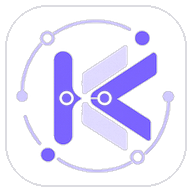

# kemo-agent-app

<p align="center">
  
</p>

<p align="center">
  <strong>简体中文</strong> · <a href="README_EN.md">English</a>
</p>

<p align="center">
  <strong>把 kemo-agent 装进口袋的 Android 生态客户端。</strong>
</p>

<p align="center">
  面向已部署的 kemo-agent 与 Kemo 网关，在手机上完成连接、对话、任务、文件、拓展感知与智能体配置管理，<br>
  让属于你的智能体不再只停留在电脑前。
</p>

<p align="center">
  <a href="https://github.com/kesepain-KE/kemo-agent-app"></a>
  <a href="LICENSE"></a>
</p>

---

## 当智能体离开电脑

kemo-agent 已经能够在服务器上持续工作：记住你在意的事、推进复杂的计划、在约定时间醒来完成被托付的任务。

但它一直住在电脑里。

出门之后，你与它之间只剩一块小小的屏幕。想看看任务进展如何、想继续一段对话、想确认服务是否正常，都需要先找到一台能打开网页的设备。

kemo-agent-app 想做的是让这段关系随身携带。

它是 kemo-agent 生态的 Android 客户端：连接你部署好的 kemo-agent 与 Kemo 网关之后，对话、任务、文件、拓展感知、运行状态与智能体配置，都可以在手机上继续。

---

## 一个入口，连接整个 Kemo 生态

| 场景 | kemo-agent-app 带来的体验 |
|---|---|
| 出门在外 | 继续与智能体流式对话，查看思考过程与工具执行结果，不必回到电脑前 |
| 任务推进 | 查看任务计划进展，批准、暂停或中止步骤；桌面小组件让待办一目了然 |
| 随手确认 | 查看 Kemo 服务是否在线，以及会话、队列、缓存、上下文等运行指标 |
| 文件往来 | 浏览工作区文件，上传资料、下载智能体生成的结果，支持常见格式预览 |
| 能力管理 | 打开或关闭拓展与感知模块，查看感知注入的数据 |
| 配置调整 | 在手机上完成与网页版一致的智能体配置：模型、Provider、白名单与注入策略 |
| 账号切换 | 保存多个连接账号，随时切换不同的智能体或网关 |
| 安全守护 | 生物识别或设备凭据解锁，App 密码与后台自动锁定保护你的会话 |

这些能力不是零散的功能堆叠，而是同一个目标的不同侧面：无论你在哪里，你的智能体仍然触手可及。

---

## 连接：一段可靠的桥

kemo-agent-app 通过桥接服务连接部署好的 kemo-agent，连接页完成两级认证：设备 Token 与用户账号密码。

- 支持记住凭证，使用 Android Keystore 加密保存，最长保留 7 天；
- 支持多个账号并存，在「我的」页随时切换；
- 可选设置 App 密码，作为打开应用时的第一道防线。

---

## 助手：把对话继续下去

聊天页围绕真实对话组织，而不是只提供一个输入框：

- 流式输出，逐字呈现智能体的回复；
- Markdown 渲染，代码块、列表与引用清晰可读；
- 展示思考过程与工具调用（参数、结果、成功或失败），让智能体的一举一动可以被理解；
- 显示 Token 消耗、缓存命中与响应耗时；
- 历史会话可以保存、切换、删除，也可以一键清除当前对话或手动压缩上下文；
- 支持添加附件，把文件交给智能体处理；
- 常用操作（清除对话、保存历史、压缩上下文、保存并新对话）聚合为快捷入口。

---

## 任务：让每一步进展都清晰可见

任务页同时承载任务计划与定时任务：

- 任务计划按状态筛选（待批准、运行中、已完成、失败），展示步骤进度；
- 批准、暂停、恢复、中止，随时掌握节奏；
- 定时任务可以查看与编辑，调度参数一目了然；
- 桌面小组件展示待批准数量与最新任务，点击直达任务页；
- 通过 `kemo://task` 深链，可以从任意入口直接打开任务界面。

---

## 文件：工作区随身携带

文件页把上传文件与智能体生成文件分开管理：

- 浏览服务器工作区目录，进入任意层级；
- 上传本地文件，下载或删除远程文件；
- 常见格式直接在 App 内预览；无法解析的文件会提示下载后交由系统应用打开；
- 下载位置可以自定义，也可以随时恢复系统默认目录。

---

## 拓展与感知：能力开关在手边

拓展感知页列出当前可用的拓展与感知模块：

- 查看模块名称、层级与启用状态；
- 直接打开或关闭模块（写入白名单），调整注入策略；
- 查看感知来源与注入数据，了解智能体正在「看到」什么。

---

## 状态与配置：一切尽在掌握

- 状态页显示 Kemo 服务在线状态与最新运行快照，包括版本、上游连接、运行健康、会话、消息队列、缓存、上下文、拥塞与模型服务等指标；
- 配置页与网页版当前用户配置保持一致：模型与 Provider（Base URL、API Key、思考强度、流式输出、多模态输入）、子智能体模型、多模态模型、知识范围、共享技能/拓展/感知/插件白名单、拓展与感知注入策略、任务计划自动接受；
- 模型列表由桥接服务使用已保存的 Kemo 凭证安全获取，不在手机端保存服务商密钥。

---

## 安全与隐私

- 连接凭证使用 Android Keystore 加密保存；
- 支持生物识别 / 设备凭据解锁，也可设置 App 密码；
- 后台 5 分钟自动锁定，验证身份后才能修改安全设置；
- 模型列表、配置修改等敏感操作由服务端鉴权，App 只扮演受信任的入口。

---

## 开始体验

### 环境要求

- Android Studio（最新稳定版）
- JDK 17
- Android SDK 36（compileSdk / targetSdk）

### 获取并构建

```bash
git clone https://github.com/kesepain-KE/kemo-agent-app.git
cd kemo-agent-app
```

使用 Android Studio 打开项目并运行到设备，或使用命令行构建：

```bash
./gradlew assembleDebug
```

构建产物位于：

```text
app/build/outputs/apk/debug/app-debug.apk
```

### 连接你的智能体

1. 安装并打开 App；
2. 在连接页填写桥接服务地址（模拟器访问宿主机默认 `http://10.0.2.2:8742`）、设备 Token、用户名与用户密码；
3. 连接成功后即可开始对话与管理任务。

> 需要先部署并运行 [kemo-agent](https://github.com/kesepain-KE/kemo-agent) 与 [kemo-adapter-api](https://github.com/kesepain-KE/kemo-adapter-api) 网关，并配置好账号与设备 Token。

---

## 我们希望它成为什么

kemo-agent-app 并不试图替代网页端或命令行。

它更希望成为 Kemo 生态中自然而然的延伸：

- 需要完整工作台时，回到网页端；
- 需要快速处理时，打开命令行；
- 需要随身携带时，掏出手机。

无论入口如何变化，连接的仍是同一位智能体、同一段历史、同一份信任。让智能体真正成为可以随时交谈的伙伴，而不只是一台电脑里的程序。

---

## 当前状态

当前版本：`1.1.0`（versionCode 2）

`1.1.0` 在 1.0 的基础上带来一轮体验升级：聊天页支持数学公式渲染与媒体卡片，可以随时停止生成、重新回复上一轮，并能在回复期间继续发送引导；后台轮询会在回复完成时推送通知；设置页可挑选图片或视频作为全局背景；任务与模块卡片点击即可查看完整详情；文件预览扩展到音频、视频与 PDF；配置页的模型选择换成可搜索的选择器；App 内新增关于页，可直接检查 GitHub Releases 并下载安装新版本。

`1.0` 是 kemo-agent-app 的首个正式版本，覆盖 Kemo 生态移动端的基础能力：连接与两级认证、流式对话、任务计划与定时任务、文件管理、拓展感知开关、运行状态、智能体配置、安全解锁与桌面小组件。

目前可以体验的内容包括：

- 底部五个主入口：助手、任务、文件、拓展感知、我的；
- 流式聊天与 Markdown 渲染，展示思考过程与工具调用详情；
- 历史会话保存、切换、删除与上下文压缩；
- 任务计划状态筛选与批准/暂停/恢复/中止，定时任务查看与编辑；
- 桌面任务小组件与 `kemo://task` 深链直达；
- 上传/生成文件分区管理、预览与自定义下载目录；
- 拓展与感知模块启停（白名单）与注入数据查看；
- 服务健康状态与运行指标快照；
- 与网页版一致的智能体配置编辑（Provider、子代理模型、多模态模型、白名单、注入策略）；
- Kemo 协议模型列表安全获取与选择；
- 中英文界面、浅色/深色/跟随系统主题、强调色与动态取色；
- 生物识别解锁、App 密码、后台自动锁定；
- 多账号保存与切换。

仍在持续打磨的方向：

- 更多设备形态与折叠屏的适配；
- 推送通知的完善与可靠性；
- 更多文件类型的预览支持；
- 性能与耗电的持续优化。

如果你正在试用早期版本，欢迎提交遇到的问题与使用感受。

---

## 相关项目

- [kemo-agent](https://github.com/kesepain-KE/kemo-agent)  
  本项目所连接的核心智能体框架：本地多用户 Agent Runtime，提供对话、记忆、任务、知识、拓展与感知等完整能力。

- [kemo-adapter-api](https://github.com/kesepain-KE/kemo-adapter-api)  
  与 kemo-agent 配合使用的模型服务适配网关，kemo-agent-app 通过它完成桥接与两级认证。

- [kemo-graph](https://github.com/kesepain-KE/kemo-graph)  
  知识图谱与 RAG 检索项目，可外挂为 kemo-agent 的超级文档站。

---

## 主要维护者

[@kesepain](https://github.com/kesepain-KE)

---

## 参与贡献

kemo-agent-app 仍处在非常早期的阶段。无论是问题报告、体验建议、文档改进还是功能贡献，都很欢迎。

推荐流程：

1. Fork 本仓库；
2. 创建自己的功能分支；
3. 完成修改并进行必要验证；
4. 提交 Pull Request，说明改变了什么以及为什么。

---

## 开源协议

本项目基于 [Apache License 2.0](LICENSE) 开源。
